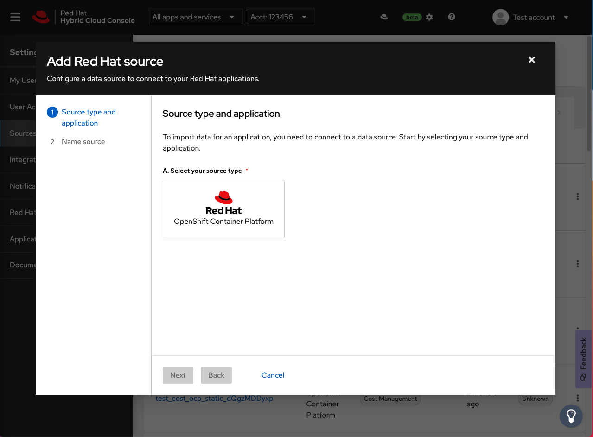

# Sources


[](https://travis-ci.com/RedHatInsights/sources-ui)
[](https://codecov.io/gh/RedHatInsights/sources-ui)

List of Sources for Red Hat Hybrid Cloud Console.

This application allows to
- view all sources (filtering, sorting)
- add a new source (AWS, Google, Azure, OpenShift, ...)
- connect an application to a source (Cost Management, RHEL management bundle, ...)
- remove an application from a source
- pause/resume a source/application

**Table of Contents**
- [Sources](#sources)
- [Getting Started](#getting-started)
  - [Run app](#run-app)
  - [Debug functions](#debug-functions)
- [Queries](#queries)
- [Testing](#testing)
- [Patternfly](#patternfly)
- [Data-driven forms](#data-driven-forms)
- [Insights Chrome](#insights-chrome)
- [Config](#config)
- [Insights Components](#insights-components)
- [AddSourceWizard](#addsourcewizard)
  - [Updating steps in the wizard](#updating-steps-in-the-wizard)
- [API](#api)
  - [Sources Javascript API client](#sources-javascript-api-client)
- [Insights Frontend Assets](#insights-frontend-assets)
- [Deploying](#deploying)
  - [How it works](#how-it-works)
- [License](#license)

# Getting Started
## Run app

1. ```npm install```

2.  ```npm run start```
    - starts webpack bundler and serves the files with webpack dev server on `https://stage.foo.redhat.com:1337/settings/sources/`

2.  ```npm run start:beta```
    - starts webpack bundler and serves the files with webpack dev server on `https://stage.foo.redhat.com:1337/beta/settings/sources/`

You have to be connected to Red Hat VPN and use Red Hat squid proxy settings (check source.redhat.com for a guide). Check also, if you have updated `/etc/hosts/` file to route these adresses to localhost. (See [script](https://github.com/RedHatInsights/insights-proxy/blob/master/scripts/patch-etc-hosts.sh))

Check our [proxy documenation](https://github.com/RedHatInsights/frontend-components/tree/master/packages/config#useproxy) for more options.

## Debug functions

Sources UI provides easy way how to test different states of the application when running in dev environment.

Run from the console one of following commands:

- ```sourcesDebug.showEmptyState```

Sets number of currently loaded sources to 0. Shows empty state.

- ```sourcesDebug.setCount```

Changes number of sources to a value you need.

- ```sourcesDebug.removePermissions```

Removes write permissions.

- ```sourcesDebug.setPermissions```

Grants write permissions.

# Queries

You can use queries to modify the initial state of the application. Read more [here](doc/url-query.md).

# Testing

- Travis is used to test the build for this code.
  - `npm run test` will run tests locally,
  - `npm run lint` will run just the linter.

# Patternfly

- This project imports Patternfly components:
  - [Patternfly React](https://github.com/patternfly/patternfly-react)

# Data-driven forms

- This project uses Data-driven forms:
  - [Data Driven Forms repository](https://github.com/data-driven-forms)
  - [Data Driven Forms documentation](http://data-driven-forms.org/)


# Insights Chrome

[Insights Chrome](https://github.com/RedHatInsights/insights-chrome) is an application that wraps all the UI applications in Red Hat Hybrid Cloud Console. It using Federated modules to do that.

# Config

[Cloud Services Config](https://github.com/RedHatInsights/cloud-services-config) manages the UI navigation and Akamai configuration.
# Insights Components

[Red Hat Insights Frontend Components](https://github.com/RedHatInsights/frontend-components)

Insights Platform will deliver components and static assets through [npm](https://www.npmjs.com/package/@redhat-cloud-services/frontend-components).

# AddSourceWizard

**ADD SOURCE WIZARD WAS MOVED TO THIS REPOSITORY!**

Documentation is [here](doc/wizard.md).

## Updating steps in the wizard

- See [Update wizard](doc/update-wizard.md). This guideline provides info how to update the add source wizard.

# API

- [Sources API](https://github.com/RedHatInsights/sources-api) **NOT IN USE ANYMORE**
- [Sources API GO](https://github.com/RedHatInsights/sources-api-go) - a new GO version of the API
## Sources Javascript API client

This API client is no longer in the UI because of its huge bundle size. However, is useful to use is a documentation to the API.

- [Sources API Javascript client](https://github.com/RedHatInsights/javascript-clients/blob/master/packages/sources/doc/README.md)

# Insights Frontend Assets

Static assets are deployed to [Insights Frontend Assets](https://github.com/RedHatInsights/frontend-assets) repository. If you need to add/change/remove some icon, please do it there.

# Deploying

- The Platform team is using Travis to deploy the application

## How it works

|Branch|updates|environment|
|------|:------:|-----------|
|`master`|=>|**stage/beta** and **stage/stable**|
|`prod-beta`|=>|**prod/beta**|
|`prod-stable`|=>|**prod/stable**|

Example:

- any push to the `master` branch will deploy to a `sources-ui-build` `master` branch **=> Stage/Beta** and **Stage/Stable**

# License

This project is available as open source under the terms of the [Apache License 2.0](http://www.apache.org/licenses/LICENSE-2.0).
